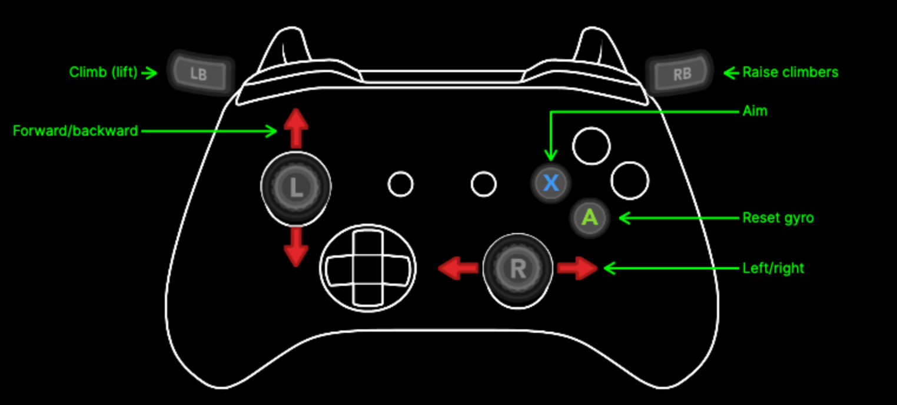
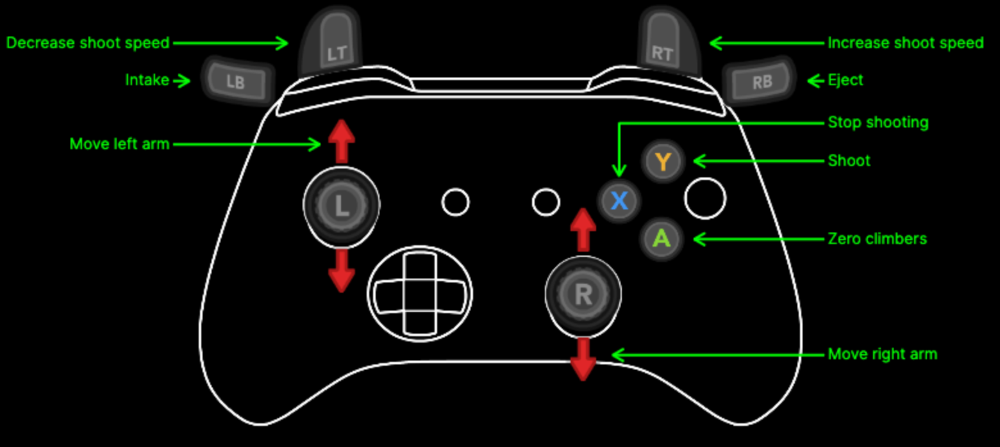

# FIRST 2026

## Deploying to roboRIO

Run the following command while inside the root directory of this project:

### Linux/macOS

```sh
python3 -m robotpy deploy
```

### Windows

```sh
py -3 -m robotpy deploy
```

## Controls

### Driver Controller



### Operator Controller



## References

- [The RobotPy Documentation](https://robotpy.readthedocs.io/en/stable/index.html)
- [Phoenix6 Documentation](https://api.ctr-electronics.com/phoenix6/2024/python/autoapi/phoenix6/index.html)
- [Limelight Documentation](https://docs.limelightvision.io/docs/docs-limelight/getting-started/summary)
